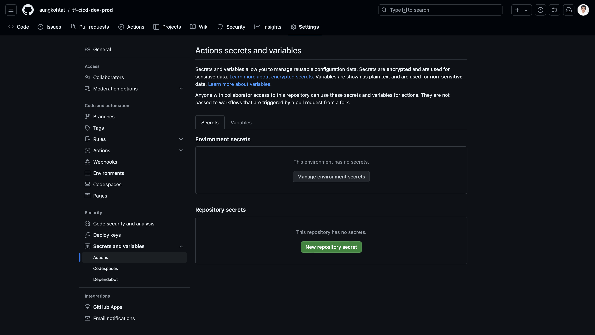
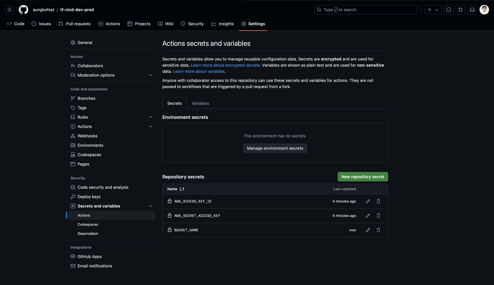

# tf-cicd-dev-prod
CI/CD pipeline configuration that implements the scenario 

**Scenario:**

Created EC2 instances for Development and Production environments using Terraform.

**CI/CD Process:**

1. **Infrastructure as Code (IaC):**
    - Use two branches in the repository: one for development and one for production.
2. **Continuous Integration (CI):**
    - When source code is pushed to the development branch, automatically deploy it to the development environment.
3. **Continuous Deployment (CD):**
    - If the deployment to the development environment is successful, request manual approval.
    - Once approved, automatically deploy to the production environment.
4. **Terraform State Management:**
    - Store the Terraform state files in S3, organized into separate folders for each environment (development and production).


### I will store terraform state file in below backet

1. Set Required Secret key in target repository of GitHub
### CICD Configuration in GitHub







2. CICD Workflows Step by Step

### CICD Workflows Step by Step

```
.github/workflows/cicd-dev.yml //For Automate Deploy to Development
.github/workflows/cicd-manual.yml //For Manual Approval before Automate Deploy to Production
.github/workflows/cicd-pro.yml //For Automate Deploy to Production
```

```bash

# Create and initialize the repository
mkdir tf-cicd-dev-prod
cd tf-cicd-dev-prod
git init

# Create the main branch (if not already created)
git checkout -b main

# Create the development and production branches
git branch development
git branch production

# Switch to the development branch
git checkout development

# Create the directory structure for GitHub Actions
mkdir -p .github/workflows

# Create the development workflow file
touch .github/workflows/cicd-dev.yml

# Add the development workflow file
git add .github/workflows/cicd-dev.yml

# Commit the changes
git commit -m "Add development CI/CD workflow"

# Switch to the main branch
git checkout main

# Create the manual approval workflow file
touch .github/workflows/cicd-manual.yml

# Add the manual approval workflow file
git add .github/workflows/cicd-manual.yml

# Commit the changes
git commit -m "Add manual approval workflow"

# Switch to the production branch
git checkout production

# Create the production workflow file
touch .github/workflows/cicd-pro.yml

# Add the production workflow file
git add .github/workflows/cicd-pro.yml

# Commit the changes
git commit -m "Add production CI/CD workflow"

# Create a remote repository on GitHub (assuming you've already done this)
# Replace YOUR_USERNAME with your actual GitHub username
git remote add origin https://github.com/YOUR_USERNAME/tf-cicd-dev-prod.git

# Push all branches
git push -u origin main
git push -u origin development
git push -u origin production

```


### Here is all process


### onfirm State Files in S3 separate folders for each environment


### Confirm created resources separate for each environment


